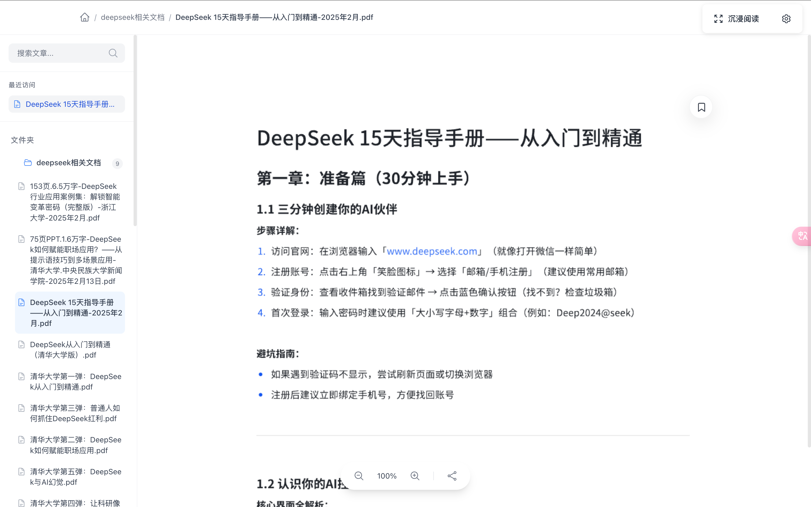
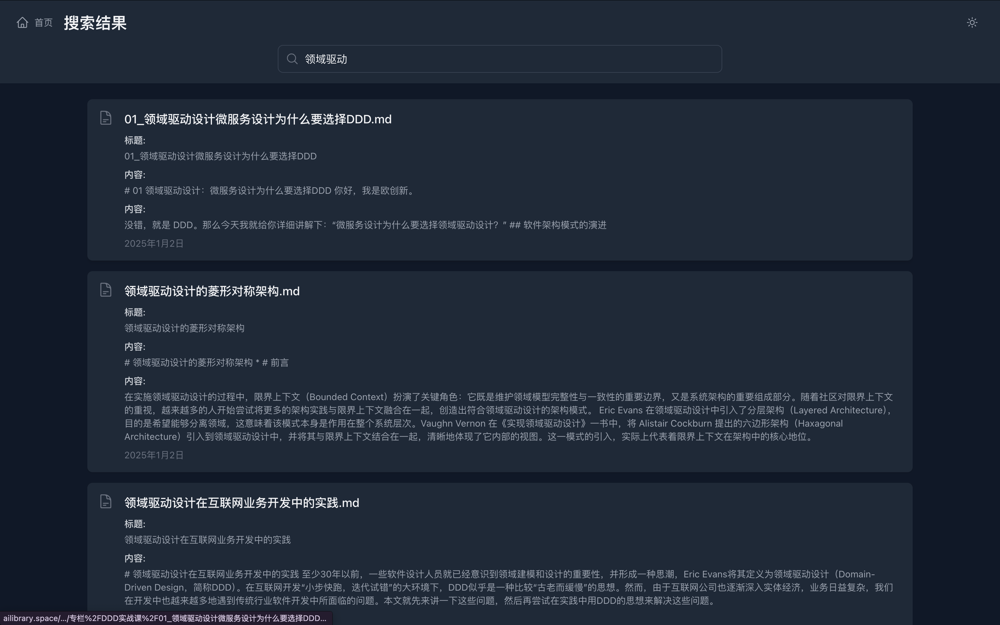

# AI Library

[](README.md)
[](README-zh.md)

AI Library 是一个由ai开发的现代化的文档管理系统，专注于提供优雅的阅读体验和高效的知识管理。

## ✨ 功能展示


### 📱 响应式布局

完美适配桌面端和移动端，提供一致的阅读体验。

### 🌓 深色模式

自动跟随系统切换，保护你的眼睛。支持浅色、深色和护眼模式。

###  沉浸护眼模式

进入深度阅读模式，排除一切干扰，自动隐藏设置栏，护眼模式低饱和暖色

### 🔍 实时搜索

快速定位文档，支持标题和内容搜索。

## 功能特点

### 阅读体验
- 沉浸式阅读模式
  - 智能隐藏非必要UI元素
  - 自动调整内容宽度和留白
  - 支持键盘快捷操作
  - 阅读进度实时显示
  - 章节导航保持显示
  - 支持自动滚动
- 多主题支持
  - 浅色主题
  - 深色主题
  - 护眼模式
- 阅读设置
  - 字体大小调节
  - 行高调整
  - 段落间距设置
  - 页面宽度控制
- 大屏优化
  - 支持24-40寸显示器自适应
  - 智能分栏布局
  - 图片优化显示

### 文档管理
- 支持多种文档格式
  - Markdown 文档
  - PDF 文件
- 树形目录结构
- 文档实时搜索
- 最近访问记录
- 阅读位置记忆
- 阅读时长统计

### 用户体验
- 响应式设计
- 多主题支持
- 优雅的动画过渡
- 手势操作支持
- 快捷键支持

### 特性
- HTTP/2 支持
- 高性能后端 API
- 实时搜索引擎
- 缓存优化

## 技术栈

### 前端
- Vue 3 (Composition API)
- TypeScript
- Tailwind CSS
- Vite
- Pinia 状态管理
- Vue Router

### 后端
- FastAPI
- Uvicorn (HTTP/2 支持)
- Python 3.10+

### 部署
- HTTPS/HTTP2
- Docker 支持
- Cloudflare Tunnel

## 环境要求

### 开发环境
- Node.js 16+
- Python 3.10+
- pip
- yarn/npm
- Git

### 生产环境
- Linux/macOS/Windows
- Docker (可选)

## 安装指南

### 1. 克隆项目
```bash
git clone https://github.com/yourusername/ai-library.git
cd ai-library
```

### 2. 后端设置
```bash
# 创建 Python 虚拟环境
python -m venv py310
source py310/bin/activate  # Linux/macOS
# 或
.\py310\Scripts\activate  # Windows

# 安装依赖
pip install -r requirements.txt

# 生成 SSL 证书（用于开发环境）
openssl req -x509 -newkey rsa:4096 -keyout server/key.pem -out server/cert.pem -days 365 -nodes
```

### 3. 前端设置
```bash
cd client
yarn install  # 或 npm install

# 开发环境配置
cp .env.example .env.local
```

## 开发指南

### 启动开发服务器

1. 后端服务器
```bash
cd server
PYTHONPATH=/path/to/project/server python run.py
```

2. 前端服务器
```bash
cd client
yarn dev  # 或 npm run dev
```

### 开发模式
- 后端服务器运行在 https://localhost:8000
- 前端服务器运行在 https://localhost:5173
- API 文档访问地址：https://localhost:8000/docs

## API接口

### 文档接口
- `GET /api/docs/tree` - 获取文档目录树
- `GET /api/docs/content/{path}` - 获取文档内容
- `GET /api/docs/metadata/{path}` - 获取文档元数据
- `GET /api/docs/recent` - 获取最近访问的文档
- `GET /api/docs/breadcrumb/{path}` - 获取文档面包屑导航

### 搜索接口
- `GET /api/search?q={query}` - 搜索文档
- `POST /api/search/rebuild-index` - 重建搜索索引

## 项目结构
```
.
├── client/                 # 前端代码
│   ├── src/
│   │   ├── components/    # Vue 组件
│   │   ├── stores/        # Pinia 状态管理
│   │   ├── services/      # API 服务
│   │   └── styles/        # 全局样式
│   └── public/            # 静态资源
├── server/                # 后端代码
│   ├── app/              # FastAPI 应用
│   │   ├── routers/      # API 路由
│   │   ├── services/     # 业务逻辑
│   │   └── models/       # 数据模型
│   ├── static/           # 静态文件
│   │   └── docs/         # 文档存储
│   └── tests/            # 测试用例
└── docs/                 # 文档目录
```

## 贡献指南

1. Fork 项目
2. 创建功能分支 (`git checkout -b feature/AmazingFeature`)
3. 提交更改 (`git commit -m 'Add some AmazingFeature'`)
4. 推送到分支 (`git push origin feature/AmazingFeature`)
5. 提交 Pull Request

## 许可证

[MIT License](LICENSE)

## 联系方式

- 项目维护者：[LY-GGBOY](li1980303503@gmail.com)
- 项目主页：[GitHub](https://github.com/Ly-GGboy/ai-library)