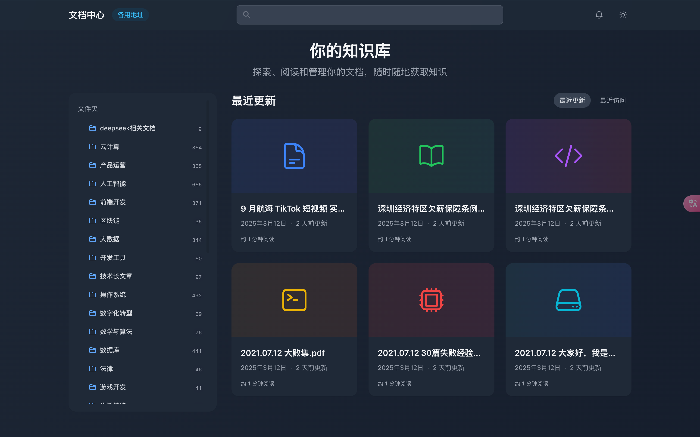

# AI Library

[](README.md)
[](README-zh.md)

AI Library is a modern document management system developed by AI, focusing on providing an elegant reading experience and efficient knowledge management.

## ✨ Features

### 📱 Responsive Layout

Perfect adaptation for both desktop and mobile devices, providing a consistent reading experience.

### 🌓 Dark Mode

Automatically follows system settings to protect your eyes. Supports light, dark, and eye-protection modes.

### 🔍 Real-time Search

Quickly locate documents, supporting both title and content search.

### 📄 High-performance PDF Reading
Support for chunk loading of large PDF files, enabling fast preview and smooth reading experience.

## Feature Details

### Reading Experience
- Immersive Reading Mode
  - Intelligently hide non-essential UI elements
  - Automatically adjust content width and margins
  - Support for keyboard shortcuts
  - Real-time display of reading progress
  - Chapter navigation remains visible
  - Support for auto-scrolling
- Multiple Theme Support
  - Light theme
  - Dark theme
  - Eye-protection mode
- Reading Settings
  - Font size adjustment
  - Line height adjustment
  - Paragraph spacing settings
  - Page width control
- Large Screen Optimization
  - Support for 24-40 inch display adaptation
  - Smart column layout
  - Optimized image display

### Document Management
- Support for Multiple Document Formats
  - Markdown documents
  - PDF files (with chunk loading support)
- Tree Directory Structure
- Real-time Document Search
- Recent Access Records
- Reading Position Memory
- Reading Time Statistics

### Advanced PDF Features
- Chunk Loading Technology
  - Quick opening of large PDF files
  - Load page content on demand
  - Intelligent caching of loaded pages
- Reading Controls
  - Page zooming
  - Page rotation
  - Precise page navigation
  - Page thumbnail navigation
- Performance Optimization
  - Memory usage optimization
  - Rendering performance optimization
  - Cache management

### User Experience
- Responsive Design
- Multiple Theme Support
- Elegant Transition Animations
- Gesture Operation Support
- Keyboard Shortcut Support

### System Features
- HTTP/2 Support
- High-performance Backend API
- Real-time Search Engine
- Multi-level Cache Optimization
- Automatic Maintenance Tasks

## Technology Stack

### Frontend
- Vue 3 (Composition API)
- TypeScript
- Tailwind CSS
- Vite
- Pinia State Management
- Vue Router
- PDF.js (PDF Rendering)

### Backend
- FastAPI
- Uvicorn (HTTP/2 Support)
- Python 3.10+
- PyPDF2 (PDF Processing)
- SQLite Database
- Asynchronous IO Processing

### Deployment
- HTTPS/HTTP2
- Docker Support
- Cloudflare Tunnel

## Environment Requirements

### Development Environment
- Node.js 16+
- Python 3.10+
- pip
- yarn/npm
- Git

### Production Environment
- Linux/macOS/Windows
- Docker (optional)

## Installation Guide

### 1. Clone the Project
```bash
git clone https://github.com/yourusername/ai-library.git
cd ai-library
```

### 2. Backend Setup
```bash
# Create Python virtual environment
python -m venv py310
source py310/bin/activate  # Linux/macOS
# or
.\py310\Scripts\activate  # Windows

# Install dependencies
pip install -r requirements.txt

# Generate SSL certificate (for development environment)
openssl req -x509 -newkey rsa:4096 -keyout server/key.pem -out server/cert.pem -days 365 -nodes
```

### 3. Frontend Setup
```bash
cd client
yarn install  # or npm install

# Development environment configuration
cp .env.example .env.local
```

## Development Guide

### Start Development Server

1. Backend Server
```bash
cd server
PYTHONPATH=/path/to/project/server python run.py
```

2. Frontend Server
```bash
cd client
yarn dev  # or npm run dev
```

### Development Mode
- Backend server runs at https://localhost:8000
- Frontend server runs at https://localhost:5173
- API documentation available at: https://localhost:8000/docs

## API Interfaces

### Document Interfaces
- `GET /api/docs/tree` - Get document directory tree
- `GET /api/docs/content/{path}` - Get document content
- `GET /api/docs/metadata/{path}` - Get document metadata
- `GET /api/docs/recent` - Get recently accessed documents
- `GET /api/docs/breadcrumb/{path}` - Get document breadcrumb navigation

### PDF Interfaces
- `GET /api/pdf/metadata/{path}` - Get PDF metadata and chunk information
- `GET /api/pdf/chunk/{path}?start={start}&end={end}` - Get specific page range of PDF

### Search Interfaces
- `GET /api/search?q={query}` - Search documents
- `POST /api/search/rebuild-index` - Rebuild search index

## Project Structure
```
.
├── client/                 # Frontend code
│   ├── src/
│   │   ├── components/    # Vue components
│   │   ├── stores/        # Pinia state management
│   │   ├── services/      # API services
│   │   └── styles/        # Global styles
│   └── public/            # Static resources
├── server/                # Backend code
│   ├── app/              # FastAPI application
│   │   ├── routers/      # API routes
│   │   ├── services/     # Business logic
│   │   └── models/       # Data models
│   ├── static/           # Static files
│   │   └── docs/         # Document storage
│   │       └── __pdf_chunks__/ # PDF chunk cache
│   └── tests/            # Test cases
└── docs/                 # Documentation directory
```

## Contribution Guide

1. Fork the project
2. Create a feature branch (`git checkout -b feature/AmazingFeature`)
3. Commit changes (`git commit -m 'Add some AmazingFeature'`)
4. Push to the branch (`git push origin feature/AmazingFeature`)
5. Submit a Pull Request

## License

[MIT License](LICENSE)

## Contact

- Project Maintainer: [LY-GGBOY](li1980303503@gmail.com)
- Project Homepage: [GitHub](https://github.com/Ly-GGboy/ai-library)